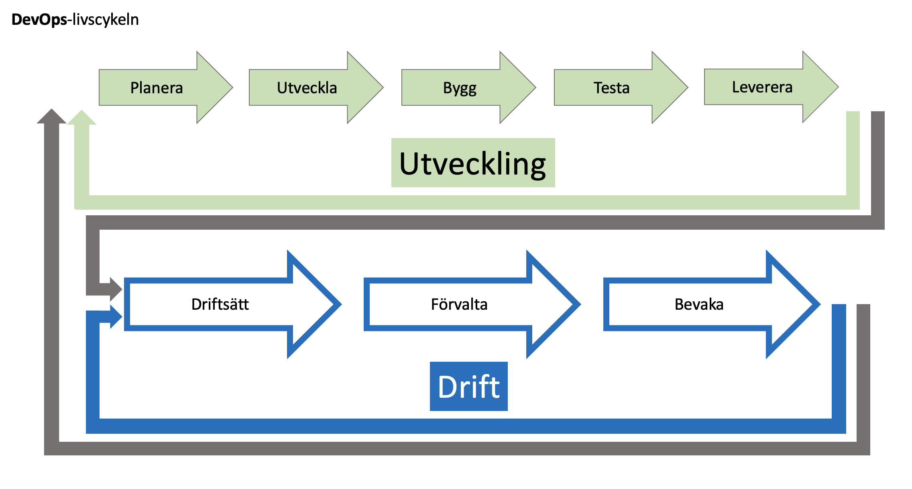

  

Detta är från början en svensk översättning [DevSecOps Fundamentals Playbook](https://public.cyber.mil/dod-enterprise-devsecops-2/) från Department of Defense. Förhoppningen är att dessa dokument kan få ett eget liv mha av flera organisationer inom offentlig sektor. Så att vi tillsammans kan utveckla en god förståelse för hur DevOps och DevSecOps kan hjälpa oss att bli ännu bättre på både utveckling och förvaltning. 

DevOps kan ses som en modern implementation av Lean och Agile och det är en rörelse som hjälper organisationer att : 
1. Korta ned ledtiderna från idé och planering till change  
2. Implementera kontinuerliga leveranser för att underlätta iterativ utveckling och möjliggöra kontinuerlig feedback från användare och andra intressenter  
3. Minska felfrekvensen vid change  
4. Korta ned återställningstiden (MTTR - Mean time to restore) för de tillfällen då driftsättningar behöver rullas tillbaka  